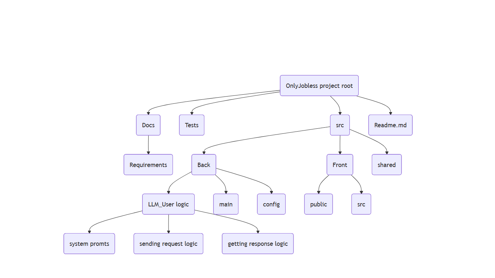
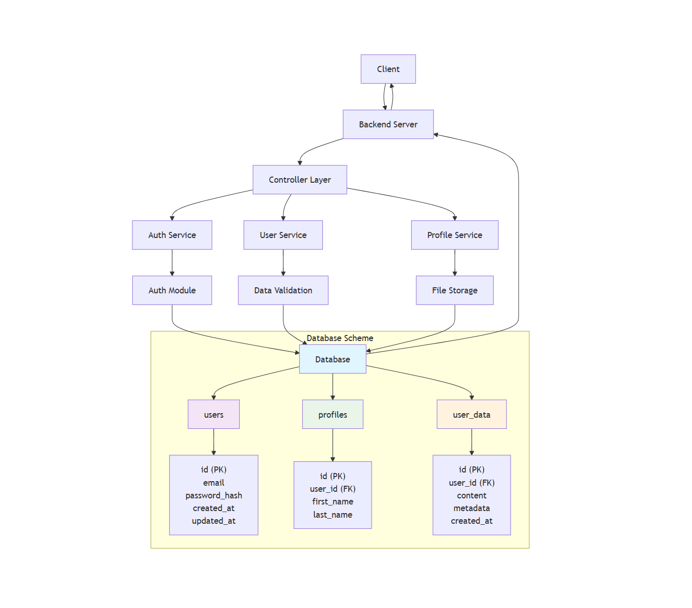

# OnlyJobless

This project represents web-service where you can train your interview skills throughout LLMs. Beat the awkwardness, fight the panic, and maybe even get the job you want.

## Project Structure

## DB-Service scheme

## Задачи участников:
1. TL: Яновский Всеволод. Задачи: Реализация возможности регистрации пользователей на сервисе для их дальнейшей авторизации. Реализация безопасного хранения паролей в БД. Ревью кода участников. "Косметические" паравки кода участников.  Срок выполнения задачи: 4-5 дней.

2. DEV1: Густов Ян. Задачи: половина Backend. Срок выполнения 2 дня.

3. DEV2: Мохамед Али. Задачи: Фронт(смотреть раздел что видит пользователь). Срок выполнения: 4-5 дней.

4. DEV3: Моргоев Амиран. Задачи: Реализация хранения пользовательских данных в БД, а так же их изменения. Срок выполнения: 4-5 дней.

5. DEV4: Евкарпиди Леонид. Задачи: половина Backend. Сркок выполнения: 4-5 дней. 

## Что будет видеть пользователь(безработный лох):
При запуске сервиса пользователь видит окно регистрации, указывает имя/логин, пароль и предпочитаемый язык интерфейса и взаимодействия с LLM после чего завершает регистрацию или может выбрать опцию "Log in" и авторизоваться. Далее он видит интерфейс сервиса и боковую панель со списком сохранённых чатов. По кнопке начать новый чат в и ему предлагается ввести название должности на которую он хочет пройти собеседование. После выбора он переходит в диалоговое окно, где видит приветствие от LLM и первый вопрос. 
В диалоговом окне есть возможностьи:
1. Отправлять сообщения и получать ответы LLM.
2. Получить подсказку нажатием кнопки "Hint".
3. Получить ответ на текущий вопрос кнопкй "Get Answer".
4. Завершить симуляцию собеседования и получить оценку и подробный отзыв от LLM по кнопке "Finish Interview".
5. Доступно сохранение истории чатов для каждого пользователя, поддержка большого количества чатов одновременно. Есть возможность очистки чатов по кнопке "Clear Chat History".

Также в интерфейсе есть кнопка перехода к окну настроек, где можно изменить:
1. Имя пользователя.
2. Пароль.
3. Предпочитаемый язык.
## Задачи проекта:
Реализация веб сервиса, позволяющего пользователю тренировать навыки прохождения собеседований с помощью LLM. 
Для этого необходимо:
1. Написать логику взаимодействия пользователя с LLM через API.
2. Реализовать обработку ответов LLM для их удобного представления пользователю.
3. Написать серверную часть(фронт).
4. Подключить базу данных для хранения информации пользователей и поддержки пользовательских аккаунтов.
5. Покрыть тестами.
6. Развернуть в Dockerhub + облачная среда.

