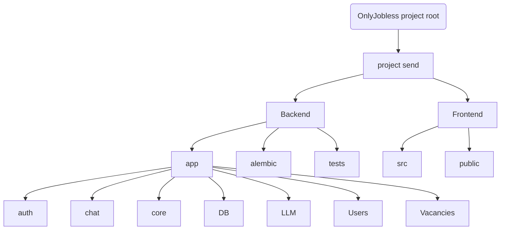
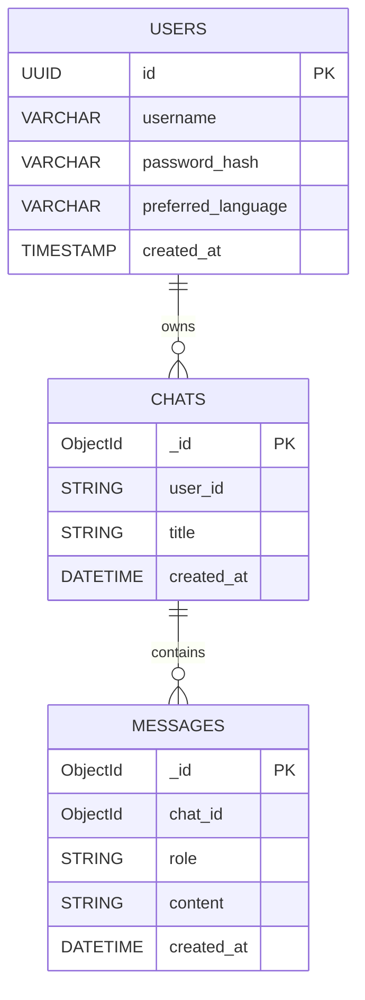

# OnlyJobless


This project represents web-service where you can train your interview skills throughout LLMs. Beat the awkwardness, fight the panic, and maybe even get the job you want.

## Project Structure


## DB-Service scheme


## Задачи участников:
1. TL: Яновский Всеволод. Задачи: Авторизация/регистрация + кодревью. Срок выполнения: 4-5 дней.

2. DEV1: Густов Ян. Задачи: Фронтенд. Срок выполнения 4-5 дней.

3. DEV2: Мохамед Али. Задачи: БД. Срок выполнения: 4-5 дней.

4. DEV3: Моргоев Амиран. Задачи: Функции чата. Срок выполнения: 4-5 дней.

5. DEV4: Евкарпиди Леонид. Задачи: Подключение ЛЛМ. Срок выполнения: 4-5 дней. 
## ОБЗОР (архитектура и функциональность)

### 1. ПОЛЬЗОВАТЕЛЬСКИЙ ОПЫТ (ЧТО ВИДИТ ПОЛЬЗОВАТЕЛЬ)

**Аутентификация:**
- Пользователь может зарегистрироваться с логином и паролем
- Пользователь может войти в систему
- Доступ основан на JWT-токенах
- Неавторизованные пользователи не могут получить доступ к чатам

**Использование чата:**
- Пользователь видит список своих чатов
- Пользователь может создать новый чат
- Пользователь может открыть существующий чат
- Пользователь может отправлять сообщения
- Пользователь получает ответы, сгенерированные ИИ
- История чата сохраняется

**Типичный сценарий:**
Вход → Создать чат → Задать вопрос → Получить ответ ИИ → Продолжить диалог

**Альтернативные сценарии:**
- Возобновить старый чат
- Создать несколько чатов для разных тем
- Длительная беседа в стиле интервью

---

### 2. ИНТЕГРАЦИЯ С LLM

Интеграция с LLM реализована как отдельный слой.

**Расположение:**
`app/llm/client.py`

**Обязанности:**
- Формирование промпта из истории чата
- Отправка запроса во внешний LLM API
- Получение сгенерированного ответа
- Возврат ответа в сервис чата

**Обработка контекста:**
- Предыдущие сообщения включаются в промпт
- Позволяет вести многоходовой диалог
- Роли системы и пользователя сохраняются

**Важные замечания:**
- LLM — это внешний сервис
- Возможны сетевые ошибки
- Ошибки приводят к HTTP 500
- Логика повтора / резервного копирования может быть добавлена позже

---

### 3. СТРУКТУРА БАЗЫ ДАННЫХ

В проекте используется гибридный подход к базам данных.

**PostgreSQL:**
Используется для структурированных и критически важных данных.

**Таблица: users**
- id (UUID, первичный ключ)
- username (уникальный)
- password_hash
- preferred_language

**MongoDB:**
Используется для гибких данных, связанных с чатами.

**Коллекции:**
- chats
- messages

**Чаты (chats):**
- принадлежат пользователю
- содержат метаданные (временные метки, заголовок)

**Сообщения (messages):**
- принадлежат чату
- включают роль (user / assistant)
- включают содержимое
- хранятся в хронологическом порядке

---

### 4. АУТЕНТИФИКАЦИЯ И АВТОРИЗАЦИЯ

**Аутентификация:**
- Аутентификация на основе JWT
- Access token (краткосрочный)
- Refresh token (долгосрочный)

**Авторизация:**
- Защищенные маршруты используют dependency injection
- `get_current_user` проверяет токен
- Гарантирует существование пользователя
- Предотвращает доступ к чужим данным

**Безопасность паролей:**
- Пароли хэшируются с использованием Argon2
- Для хэширования и проверки используется `passlib`
- Реализована проверка надежности пароля

---

### 5. ФУНКЦИОНАЛ ЧАТА (BACKEND)

**Создание нового чата:**
POST `/chat/new`
- Требует аутентификации
- Создает документ чата
- Назначает чат пользователю
- Обеспечивает соблюдение лимитов чатов

**Список чатов:**
GET `/chat`
- Возвращает только чаты пользователя
- Отсортировано по времени обновления

**Отправка сообщения:**
POST `/chat/{chat_id}/message`

**Шаги:**
1. Проверка аутентификации
2. Проверка владения чатом
3. Сохранение сообщения пользователя
4. Формирование промпта
5. Вызов LLM
6. Сохранение ответа ассистента
7. Возврат ответа во frontend

**Обработка ошибок:**
- 401 / 403: неавторизован
- 404: чат не найден
- 500: ошибка LLM или базы данных

---

### 6. FRONTEND

**Стек:**
- React
- TypeScript
- React Router
- Fetch / Axios
- CSS-анимации

**Страницы:**
- Страница входа
- Страница регистрации
- Список чатов
- Окно чата

**Особенности UI:**
- Анимированный фон
- Модальные окна ошибок
- Индикаторы загрузки
- Плавное появление сообщений

**Взаимодействие с API:**
- Access token хранится в localStorage
- К запросам прикрепляется заголовок Authorization
- Ошибки сети обрабатываются и отображаются пользователю

---

### 7. ОБЩАЯ АРХИТЕКТУРА

```
Frontend (React)
        ↓
FastAPI backend
(Auth / Chat / LLM integration)
        ↓
PostgreSQL (Users)
MongoDB (Chats & Messages)
        ↓
External LLM API
```

---

### 8. ТЕКУЩЕЕ СОСТОЯНИЕ

**Реализовано:**
- Полный цикл аутентификации
- Создание чата и обмен сообщениями
- Интеграция с LLM
- Миграции базы данных
- Тесты с покрытием ≥ 65%
- Докеризированные базы данных
- Обработка ошибок, близкая к реальным условиям

Проект ориентирован на продакшн, а не на демонстрацию.

---

### 9. ВОЗМОЖНЫЕ БУДУЩИЕ УЛУЧШЕНИЯ

- Логика повторных попыток и таймаутов для LLM
- Потоковая передача ответов (эффект печатания)
- Мок LLM для тестов
- Мягкое удаление для чатов
- Ограничение частоты запросов (rate limiting)
- Улучшенная обратная связь в пользовательском интерфейсе

## Запуск:

TERMINAL 1 — BACKEND + DATABASES

cd backend

poetry install

poetry run alembic revision –autogenerate -m “init”
poetry run alembic upgrade head

docker-compose up -d

poetry run uvicorn app.main:app –reload

Backend будет доступен по адресу:
http://127.0.0.1:8000
Swagger UI:
http://127.0.0.1:8000/docs

⸻

TERMINAL 2 — FRONTEND

cd frontend

npm install
npm run dev

Frontend будет доступен по адресу:
http://localhost:5173

⸻

TERMINAL 3 — OLLAMA (LLM)

ollama list

Если нужной модели нет:

ollama pull mistral

Ollama должен быть запущен в фоне.
