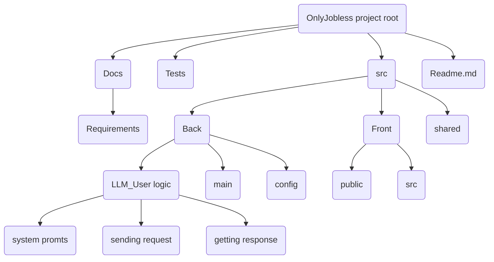
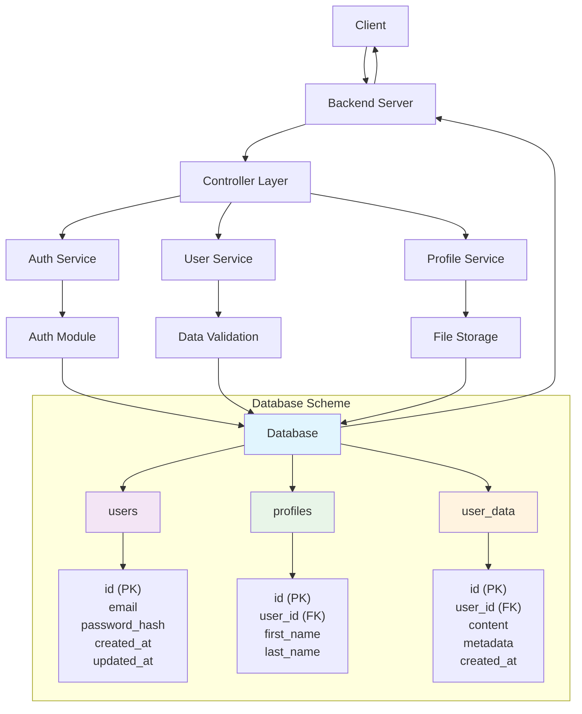

# OnlyJobless

This project represents web-service where you can train your interview skills throughout LLMs. Beat the awkwardness, fight the panic, and maybe even get the job you want.

## Project Structure

## DB-Service scheme

## Задачи участников:
1. TL: Яновский Всеволод. Задачи: Реализация возможности регистрации пользователей на сервисе для их дальнейшей авторизации. Реализация безопасного хранения паролей в БД. Распределение задач. Составление документации. Ревью кода участников. "Косметические" паравки кода участников.  Срок выполнения задачи: 4-5 дней.

2. DEV1: Густов Ян. Задачи: Обработка и нормализация ответов LLM, Работа с БД и аккаунтами, API для фронта, Деплой. Срок выполнения 4-5 дней.

3. DEV2: Мохамед Али. Задачи: Фронт(смотреть раздел что видит пользователь). Срок выполнения: 4-5 дней.

4. DEV3: Моргоев Амиран. Задачи: Реализация хранения пользовательских данных в БД, а так же их изменения. Срок выполнения: 4-5 дней.

5. DEV4: Евкарпиди Леонид. Задачи: Интеграция с LLM API, оркестрация интервью, тестирование. Сркок выполнения: 4-5 дней. 

## Что будет видеть пользователь(безработный лох):
При запуске сервиса пользователь видит окно регистрации, указывает имя/логин, пароль и предпочитаемый язык интерфейса и взаимодействия с LLM после чего завершает регистрацию или может выбрать опцию "Log in" и авторизоваться. Далее он видит интерфейс сервиса и боковую панель со списком сохранённых чатов. По кнопке начать новый чат в и ему предлагается ввести название должности на которую он хочет пройти собеседование. После выбора он переходит в диалоговое окно, где видит приветствие от LLM и первый вопрос. 
В диалоговом окне есть возможностьи:
1. Отправлять сообщения и получать ответы LLM.
2. Получить подсказку нажатием кнопки "Hint".
3. Получить ответ на текущий вопрос кнопкй "Get Answer".
4. Завершить симуляцию собеседования и получить оценку и подробный отзыв от LLM по кнопке "Finish Interview".
5. Доступно сохранение истории чатов для каждого пользователя, поддержка большого количества чатов одновременно. Есть возможность очистки чатов по кнопке "Clear Chat History".

Также в интерфейсе есть кнопка перехода к окну настроек, где можно изменить:
1. Имя пользователя.
2. Пароль.
3. Предпочитаемый язык.

## QA
1. Как собственно будет работать сохранение истории чатов?

В БД мы храним chat_id табличку с историей сообщений пользователя и ответов ллмки. При заходе в чат, если он не пуст ллмке через API будет отправлятся не только системный промпт с настройками сервиса, но и история конкретного чата, с требованием учитывать этот контекст. В самом интерфейсе мы просто выводим это все дело на экран, соответственно пользователь тоже сможет видеть историю конкретного чата. Если пользователь создает новый чат, то контекстный промпт ллмке не отправляется, при каждом следующем запросе ллмке отправляется весь контекст чата, чтобы она могла более точно отвечать, учитывая контекст ваших сообщений!

2.Что насчет безопасности? 

Команда OnlyJobless заботится о безопасности ваших персональных данных. Все ваши пароли будут хранится хешами, а номер телефона, email и юзернейм в зашифрованном виде, ключ будет безопасно лежать, невидимым для всего остального мира, так что, даже если злоумышленники получат доступ к нашей БД, то вы можете не переживать о раскрытии ваших данных, все, что они получат, это абсолютно бесполезный набор данных и доступа к вашим аккаунтам у них не будет.

3.Какие модели доступны? 

К сожалению, команда OnlyJobless оправдывает название нашего проекта, и мы все являемся безработными студентами, поэтому не можем предоставить вам доступ к продвинутым платным моделям, таким как ChatGPT, Claude или Gemini. Мы будем использовать следующие бесплатные ллм: Qwen, Deepseek.

4. Можно ли будет выбрать модель с которой вы хотите общаться?

КОНЕЧНО!

6. Как именно бекенд будет общаться с моделькой?

Мы используем только официальные API моделей.

7. Какой протокол?

Все просто, наш выбор пал на REST API(для для управления аккаунтами) + WebSocket(для общения с LLM).

8.Как же модель поймет что ей делать? 

Мы напишем системный промпт, в котором укажем модели быть интервьюером для должности указанной пользователем.

9. В каком формате все будет отображаться? Что именно будет видеть пользователь?

Все будет примерно так:
1) Во время загрузки ответа LLM вы будете видеть стандартный для большинсва чат-ботов индикатор.
2) Боковая панель будет так же выглядеть привычно, так же как и в большинстве чат-ботов, например Chat-GPT

10. В каком формате будет оценка?

Не волнуйтесь, при завершении интервью  LLM пришлет не только оценку(например 9/10), но и подробный отзыв с указанием ваших ошибок

12. Влияет ли получение подсказки/ответа на вопрос на итоговую оценку?

Крнечно да, это же сохраняется в истории чата, а при выставлении оценки мы попросим модель анализировать весь чат, и конечно дадим ей указание снижать оценку.

13. Можно ли удалять чаты?

Да, это стандартная практика

14. В каком формате ответ?

Формат ответа LLM это текст. Но при запросе подсказки, ответа может быть отправлен кусок кода, конечно же синтаксис будет подсвечиваться!

15. Что будет при сбое сети?

При сбое сети будет показано всплывающее окно в верхней части экрана, с сообщением об отсутствии соединения.

16. А что если чат очень длинный?

Не будет. Количество вопросов в интервью не позволит вам выйти за лимиты, а использовать сервис не по назначению, например спрашивать что подарить бабушке на новый год не выйдет - модель просто не ответит на этот вопрос, это будет указано в системном промпте, а после завершения интервью вы не сможете общаться в этом же чате, нужно будет его очистить или создать новый.

17. Можно ли выбрать уровень сложности?

Конечно, вакансия под собой это и подрузамевает, вы будете проходить собеседование например на middle baackend C++ разработчика, а не просто на программиста. Все зависит от того какую выкансию вы укажете в желаемой.

18. Можно ли выбрать тип собеседования?

Да.

## Задачи проекта:
Реализация веб сервиса, позволяющего пользователю тренировать навыки прохождения собеседований с помощью LLM. 
Для этого необходимо:
1. Написать логику взаимодействия пользователя с LLM через API.
2. Реализовать обработку ответов LLM для их удобного представления пользователю.
3. Написать серверную часть(фронт).
4. Подключить базу данных для хранения информации пользователей и поддержки пользовательских аккаунтов.
5. Обеспечить безопасность хранения персональных данных юзера.
6. Обеспечить возможность отображения истории чатов и использования контекста.
7. Покрыть тестами.
8. Развернуть в Dockerhub + облачная среда.
