# OnlyJobless

This project represents web-service where you can train your interview skills throughout LLMs. Beat the awkwardness, fight the panic, and maybe even get the job you want.

## Project Structure

## DB-Service scheme

```mermaid
erDiagram
    USERS {
        UUID id PK
        VARCHAR username
        VARCHAR password_hash
        VARCHAR preferred_language
        TIMESTAMP created_at
    }

    CHATS {
        ObjectId _id PK
        STRING user_id
        STRING title
        DATETIME created_at
    }

    MESSAGES {
        ObjectId _id PK
        ObjectId chat_id
        STRING role
        STRING content
        DATETIME created_at
    }

    USERS ||--o{ CHATS : owns
    CHATS ||--o{ MESSAGES : contains
```

## Задачи участников:
1. TL: Яновский Всеволод. Задачи: Реализация возможности регистрации пользователей на сервисе для их дальнейшей авторизации. Реализация безопасного хранения паролей в БД. Осуществления возможности безопасного хранения ПД. Распределение задач. Составление документации. Ревью кода участников. "Косметические" паравки кода участников. Срок выполнения: 4-5 дней.

2. DEV1: Густов Ян. Задачи: деплой, апи для фронта, обработка ответов ллм. Срок выполнения 4-5 дней.

3. DEV2: Мохамед Али. Задачи: фронт + промпты для генерации блока вопросов для каждой вакансии + их обновление 2 раза в неделю + консистентность монги и бд. Срок выполнения: 4-5 дней.

4. DEV3: Моргоев Амиран. Задачи: refresh токены + хранение чатиков в монге. Срок выполнения: 4-5 дней.

5. DEV4: Евкарпиди Леонид. Задачи: LLM API + промпты для подсказок/ответов на текущие вопросы. Срок выполнения: 4-5 дней. 

## Что будет видеть пользователь(безработный лох):
При запуске сервиса пользователь видит окно регистрации, указывает имя/логин, пароль и предпочитаемый язык интерфейса и взаимодействия с LLM после чего завершает регистрацию или может выбрать опцию "Log in" и авторизоваться. Далее он видит интерфейс сервиса и боковую панель со списком сохранённых чатов. По кнопке начать новый чат в и ему предлагается ввести название должности на которую он хочет пройти собеседование. После выбора он переходит в диалоговое окно, где видит приветствие от LLM и первый вопрос. 
В диалоговом окне есть возможностьи:
1. Отправлять сообщения и получать ответы LLM.
2. Получить подсказку нажатием кнопки "Hint".
3. Получить ответ на текущий вопрос кнопкй "Get Answer".
4. Завершить симуляцию собеседования и получить оценку и подробный отзыв от LLM по кнопке "Finish Interview".
5. Доступно сохранение истории чатов для каждого пользователя, поддержка большого количества чатов одновременно. Есть возможность очистки чатов по кнопке "Clear Chat History".

Также в интерфейсе есть кнопка перехода к окну настроек, где можно изменить:
1. Имя пользователя.
2. Пароль.
3. Предпочитаемый язык.

## Описание
1) у нас сервис только для только айти вакансий
2) для каждой вакансии генерим список из ~10-15 вопросов, и храним их в общей бд(т.е. не персонально для каждого юзера)
3) каждую неделю в пн 00:00 UTC и чт 12:00 UTC обновляем базу вопросов.
4) для каждого юзера в монге храним список чатов, а для каждого чата храним список вопросов, который туда подъезжает из бд при создании чата(все для конкретной вакансии) + для каждого вопроса два флага, первый пройден ли он и второй были ли ошибки/неточности в ответе юзера на вопрос
5) вся история для каждого конкретного чата хранится только в монге(для восстановления сеанса и оценки собеса), новые вопросы при возобновлении подъезжают из монги(те где флаг used = False)
6) после ответа на последний вопрос весь чат(из бд) отправляется ллмке на оценку
7) юзеру приходит отзыв для каждого вопроса, каждый оцениваем по 10 балльной шкале
8) те где оценка не 10 метим в монге нужным флагом (например mistakes = true)
9) после получения оценки юзер может пройти заново по тем же вопросам(эта опция нужна только если он решится по ним пройти после обновления базы иначе они и так будут те же), соответственно при выборе этой опции все флаги в монге нужно сбросить на дефолтные значения либо только отработать ошибки - тогда перезапускаем чат и выводим вопросы только с флагом mistakes = True
10) вывод вопросов/подсказок/ответов/оценки от ллм должен происходить примерно как в чатике - должна быть бегущая строка
11) так как вопросы два раза в неделю обновляются, то если юзер возвращается после того как в бдшке произошло обновление списка вопросов, то даём ему варнинг что вопросы могли устареть
12) соответственно обращаемся к ллмке только для генерации вопросов, но это один раз для вообще всех юзеров. Если конкретный юзер запросил подсказку/ответ на текущий вопрос и для оценки всего собеса

## Стек технологий(примерно):
1. Фронт: TODO.
2. Бекэнд: Python + FastApi.
3. БД: Python + sqlalchemy.
4. Авторизация: JWT.
5. Контерйнеризация: Docker.

## Тестирование:
Покрытие тестами не менее 65%

## Лимиты и ограничения:
1) До трех интервью в день на пользователя.
2) Интервью ограничевается стандартными вопросами для указанной позиции, любые попытки пользователя использовать не по назначению будут пресекаться.

## Задачи проекта:
Реализация веб сервиса, позволяющего пользователю тренировать навыки прохождения собеседований с помощью LLM. 
Для этого необходимо:
1. Написать логику взаимодействия пользователя с LLM через API.
2. Реализовать обработку ответов LLM для их удобного представления пользователю.
3. Написать серверную часть(фронт).
4. Подключить базу данных для хранения информации пользователей и поддержки пользовательских аккаунтов.
5. Обеспечить безопасность хранения персональных данных юзера.
6. Обеспечить возможность отображения истории чатов и использования контекста.
7. Покрыть тестами.
8. Развернуть в Dockerhub + облачная среда.

## Запуск:

TERMINAL 1 — BACKEND + DATABASES

cd backend

poetry install

poetry run alembic revision –autogenerate -m “init”
poetry run alembic upgrade head

docker-compose up -d

poetry run uvicorn app.main:app –reload

Backend будет доступен по адресу:
http://127.0.0.1:8000
Swagger UI:
http://127.0.0.1:8000/docs

⸻

TERMINAL 2 — FRONTEND

cd frontend

npm install
npm run dev

Frontend будет доступен по адресу:
http://localhost:5173

⸻

TERMINAL 3 — OLLAMA (LLM)

ollama list

Если нужной модели нет:

ollama pull mistral

Ollama должен быть запущен в фоне.
